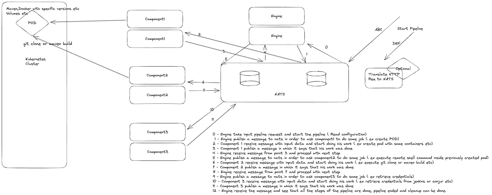

# nats-pipeline-example

## How it works

## RUN
You can use the run.sh script to build and run n instances of kubernetes,git and remote-executor components

`go build main.go && ./test-pipeline-flow`

## Configuration
You can configure the numberOfPipelines in main.go or for each component the number of consumers (numOfConsumers)
